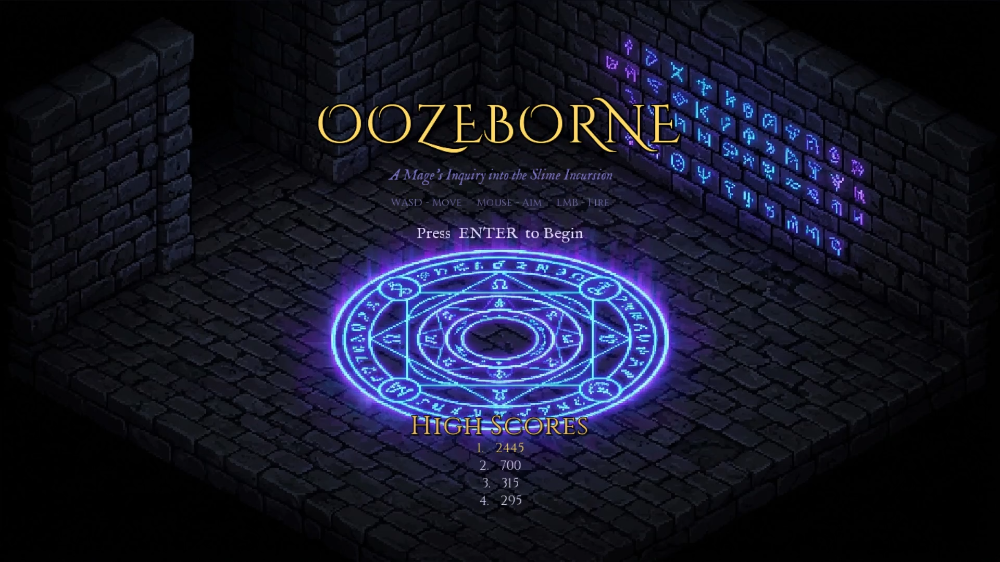
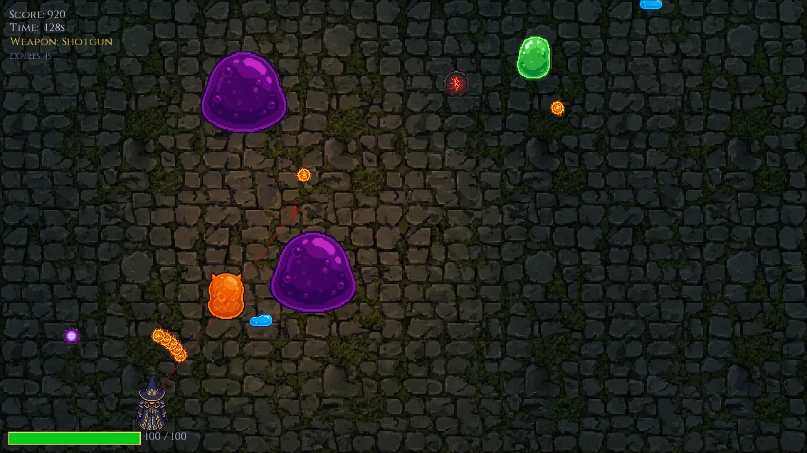

# Oozeborne
### A Mage's Inquiry into the Slime Incursion

A 2D top-down arena shooter built in Java with libGDX. You play as a mage investigating a slime incursion, surviving ten progressively harder waves of enemies culminating in a multi-phase boss fight against the Oozeborne.

> Built as a CSE215 Object Oriented Programming project at North South University, Spring 2026.

---

## Gameplay

|                                               |                                                  |
|-----------------------------------------------|--------------------------------------------------|
|  |  |
| *Main Menu*                                   | *Gameplay*                                       |

- Survive 10 waves of slime enemies across 3 maps
- Pick up weapon drops (Shotgun, Rapid Fire, Burst) and powerups (Speed, Firerate, Armour Buster, Heal)
- Face the Oozeborne — a boss with two phases, dash attacks, spiral bullet patterns, a bullet reflection mechanic, and minion summoning
- Score is tracked and top 10 high scores are saved locally

---

## Controls

| Input | Action |
|---|---|
| WASD | Move |
| Mouse | Aim |
| Left Mouse Button | Shoot |
| ESC | Pause / Resume |
| R | Restart (on Game Over / Win screen) |
| ENTER | Start game (on Main Menu) |

---

## Building and Running

### Requirements
- Java JDK 8 or higher
- No additional setup needed — Gradle handles everything

### Steps

1. Clone the repository:
```bash
git clone https://github.com/inzomniaccorvus/OozeBorne.git
cd OozeBorne
```

2. Run the game:
```bash
./gradlew lwjgl3:run
```

On Windows:
```bash
gradlew.bat lwjgl3:run
```

3. To build a runnable JAR:
```bash
./gradlew lwjgl3:jar
```
The JAR will appear in `lwjgl3/build/libs/`. Run it with:
```bash
java -jar lwjgl3/build/libs/ArenaShooter-1.0.jar
```

---

## Tech Stack

- **Language:** Java
- **Framework:** [libGDX](https://libgdx.com/)
- **Build Tool:** Gradle
- **Font Rendering:** libGDX FreeType extension
- **Fonts:** [Cinzel Decorative](https://fonts.google.com/specimen/Cinzel+Decorative), [Cinzel](https://fonts.google.com/specimen/Cinzel), [IM Fell English](https://fonts.google.com/specimen/IM+Fell+English) — Google Fonts, OFL licensed
- **Sprites & Maps:** Generated with [Nano Banana](https://nanobanana.io/)

---

## Project Structure

```
core/src/main/java/arena/shooter/
├── Main.java                  # Application entry point
├── core/
│   ├── Constants.java         # Global constants
│   ├── GameAssets.java        # Texture and animation loading
│   └── FontManager.java       # FreeType font generation
├── screens/
│   ├── GameScreen.java        # Main game loop
│   ├── MainMenuScreen.java
│   ├── GameOverScreen.java
│   └── GameWinScreen.java
├── entities/
│   ├── Player.java
│   ├── Enemy.java             # Base class
│   ├── BasicEnemy.java
│   ├── FastEnemy.java
│   ├── TankEnemy.java
│   ├── ShooterEnemy.java
│   ├── SplitterEnemy.java
│   ├── AmalgamEnemy.java      # Boss
│   ├── Bullet.java
│   ├── Drop.java
│   ├── Particle.java
│   └── DamageNumber.java
├── systems/
│   ├── BulletManager.java
│   ├── EnemyManager.java
│   ├── WaveManager.java
│   ├── Wave.java
│   ├── DropManager.java
│   ├── CollisionSystem.java
│   ├── ParticleSystem.java
│   └── ScoreManager.java
└── ui/
    └── HUD.java
```

---

## Music Credits

Music sourced from [OpenGameArt.org](https://opengameart.org/) under their respective Creative Commons licenses. Full attribution:

| Track | Author |
|---|---|
| Dark Dungeon Ambience | [Machine](https://opengameart.org/users/machine) |
| Dark Shrine Loop | [qubodup](https://opengameart.org/users/qubodup) |
| Fantasy Music and Drum Loops Pack | [NorthFantasyMusic](https://opengameart.org/users/northfantasymusic) |
| Orchestral Battle Music | [Zefz](https://opengameart.org/users/zefz) |
| Dark Souls Type Boss Theme | [ProjectHelmet](https://opengameart.org/users/projecthelmet) |
| Fantasy Sound Effects Library | [Little Robot Sound Factory](https://opengameart.org/users/little-robot-sound-factory) |

---

## License

Code is released under the [MIT License](LICENSE).  
Music assets retain their original licenses from OpenGameArt — see individual track pages for details.  
Sprite and map assets were AI-generated for this project.
